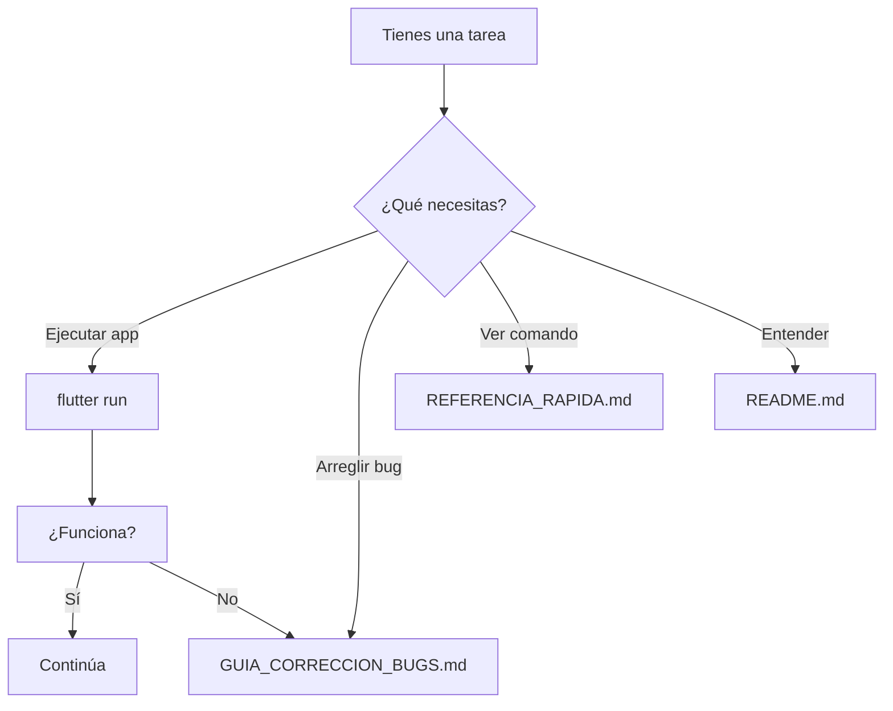

# 📚 Índice de Documentación - MiGanado

Guía rápida de los documentos disponibles y cuándo usarlos.

## 🚀 Por Dónde Empezar

**Si eres nuevo**: Lee en este orden:
1. [README.md](./README.md) - Visión general del proyecto
2. [PROXIMOS_PASOS.md](./PROXIMOS_PASOS.md) - Tareas inmediatas
3. [REFERENCIA_RAPIDA.md](./REFERENCIA_RAPIDA.md) - Comandos útiles

## 📖 Documentación Principal

| Documento | Propósito | Para Quién |
|-----------|----------|-----------|
| **[README.md](./README.md)** | Descripción completa de MiGanado, stack tecnológico, estructura | Todos |
| **[REFERENCIA_RAPIDA.md](./REFERENCIA_RAPIDA.md)** | Comandos Flutter más usados, solución de problemas rápida | Desarrolladores |
| **[PROXIMOS_PASOS.md](./PROXIMOS_PASOS.md)** | Tareas inmediatas, workflow de desarrollo, checklist | Desarrolladores |
| **[INSTALACION_ANDROID.md](./INSTALACION_ANDROID.md)** | Cómo instalar app en dispositivo Android | Usuarios/Testers |
| **[GUIA_CORRECCION_BUGS.md](./GUIA_CORRECCION_BUGS.md)** | Debugging, resolución de problemas, pasos para reportar bugs | Desarrolladores |
| **[RECOMENDACIONES_FEATURES.md](./RECOMENDACIONES_FEATURES.md)** | Nuevas características sugeridas, roadmap | Product Managers/Desarrolladores |

## 🎯 Búsqueda Rápida por Caso de Uso

### "Quiero ejecutar la app"
→ [REFERENCIA_RAPIDA.md](./REFERENCIA_RAPIDA.md#-comandos-frecuentes)

### "Quiero entender la estructura"
→ [README.md](./README.md#-estructura-del-proyecto)

### "Encontré un bug, ¿qué hago?"
→ [GUIA_CORRECCION_BUGS.md](./GUIA_CORRECCION_BUGS.md)

### "Quiero instalar en mi teléfono"
→ [INSTALACION_ANDROID.md](./INSTALACION_ANDROID.md)

### "¿Cuáles son los próximos pasos?"
→ [PROXIMOS_PASOS.md](./PROXIMOS_PASOS.md)

### "¿Qué puedo mejorar en la app?"
→ [RECOMENDACIONES_FEATURES.md](./RECOMENDACIONES_FEATURES.md)

### "Me bloquea un error en build"
→ [REFERENCIA_RAPIDA.md#-debugging-común](./REFERENCIA_RAPIDA.md#-debugging-común)

### "Quiero entender la arquitectura"
→ [README.md](./README.md#-estructura-del-proyecto)

## 🗂️ Archivos por Proyecto

```
MiGanado/
├── README.md                      ← Comienza aquí
├── REFERENCIA_RAPIDA.md          ← Comandos frecuentes
├── PROXIMOS_PASOS.md             ← Tareas del sprint
├── INSTALACION_ANDROID.md        ← Instalar en device
├── GUIA_CORRECCION_BUGS.md       ← Debugging
├── RECOMENDACIONES_FEATURES.md   ← Roadmap
├── INDICE_DOCUMENTACION.md       ← Este archivo
│
├── miganado/
│   ├── README.md                 ← Guía del código
│   ├── pubspec.yaml              ← Dependencias
│   ├── lib/
│   │   ├── main.dart
│   │   ├── features/             ← Características
│   │   ├── providers/            ← State management
│   │   ├── data/                 ← Modelos Isar
│   │   └── ...
│   └── ...
│
└── buildlog_release.txt          ← Log histórico
```

## 🔄 Flujo de Trabajo Típico



## 📝 Convenciones

- **Comandos**: Usa `flutter` para Flutter, `dart` para Dart
- **Paths**: Relativos desde raíz del proyecto (`miganado/`)
- **Bash**: Los ejemplos son para PowerShell/Bash
- **Versiones**: Flutter 3.0+, Dart 3.0+

## 📞 Cuando Necesites Ayuda

1. **Primero**: Busca en [GUIA_CORRECCION_BUGS.md](./GUIA_CORRECCION_BUGS.md)
2. **Segundo**: Revisa [REFERENCIA_RAPIDA.md](./REFERENCIA_RAPIDA.md)
3. **Tercero**: Lee documentación relevante arriba
4. **Cuarto**: Usa DevTools (`flutter pub global activate devtools`)
5. **Quinto**: Busca en Stack Overflow o Flutter Docs

## ✅ Checklist de Documentación

- [ ] Leí README.md
- [ ] Entiendo la estructura de carpetas
- [ ] Sé cómo ejecutar la app
- [ ] Sé cómo hacer un build
- [ ] Sé cómo debuggear
- [ ] Tengo DevTools instalado
- [ ] Tengo Flutter instalado y actualizado

## 🎯 Próximas Actualizaciones Sugeridas

Después de implementar cambios significativos:
- [ ] Actualizar README si hay cambios arquitectónicos
- [ ] Actualizar PROXIMOS_PASOS con nuevas tareas
- [ ] Agregar problemas conocidos a GUIA_CORRECCION_BUGS
- [ ] Actualizar REFERENCIA_RAPIDA si hay nuevos comandos

---

**Última actualización**: Enero 2026  
**Versión del Proyecto**: 1.0.0  
**Estado**: ✅ Estructura limpia y lista para desarrollo
